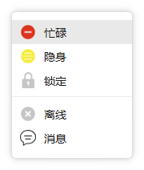

### projectName ： 	QQCustomMenu
### author: 		前行中的小猪
### date: 			2018年05月18日
### version: 		1.0

## 模仿QQ菜单样式，实现自定义菜单，通过ListWidget加载菜单项;

- 自动设置菜单高度，根据当前添加的菜单项自增菜单高度;
- 菜单宽度可根据菜单文字自行设置;
- 菜单的透明度、菜单边框阴影宽度、菜单四角圆角弧度均可设置;
- 其他菜单等样式，菜单项文字颜色，图标等均可自行设置，这里只给出一个模板，大家可自行发挥拓展;

>博客地址: https://blog.csdn.net/GoForwardToStep

